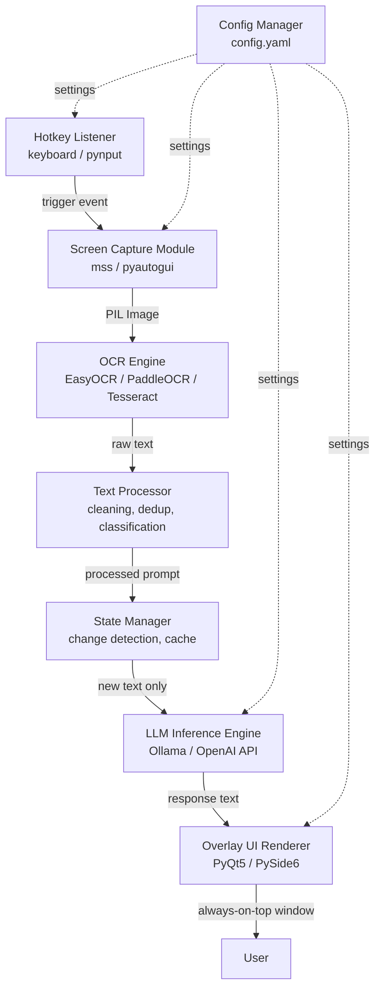
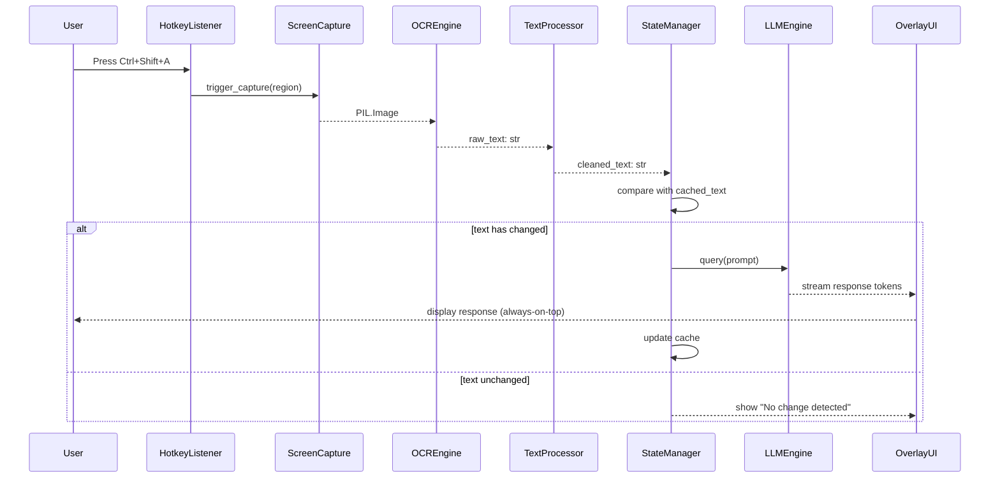
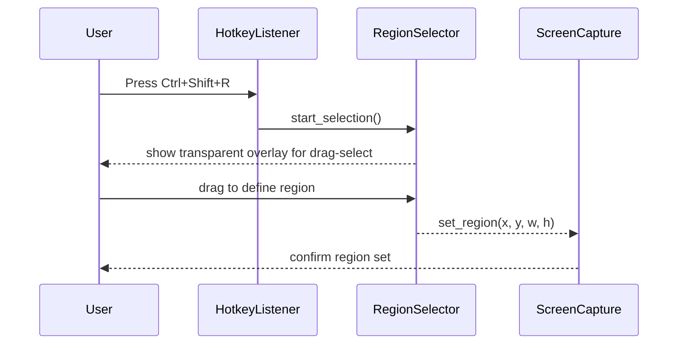

# Design Document: Local Screen-Aware AI Assistant

## Overview

A local AI-powered screen-aware assistant that runs continuously in the background on Windows, capturing user-selected screen regions, extracting visible text via OCR, and processing it through a local or remote LLM. Responses are displayed in a floating, always-on-top overlay with minimal latency. The system is designed for fully local operation (privacy-first) with an optional hybrid API mode.

The architecture follows a linear pipeline: hotkey trigger → screen capture → OCR → text processing → LLM inference → overlay rendering. Each stage is decoupled and runs asynchronously to keep the UI responsive and meet the <2–4 second end-to-end latency target.

The implementation is phased: Phase 1 delivers a working MVP (capture + OCR + LLM + overlay), with subsequent phases adding region selection, hotkey configurability, multi-threading, and vision model support.

---

## Architecture



---

## Sequence Diagrams

### Main Capture-to-Response Flow



### Region Selection Flow



---

## Components and Interfaces

### Component 1: HotkeyListener

**Purpose**: Listens for global keyboard shortcuts and dispatches capture or UI events.

**Interface**:
```python
class HotkeyListener:
    def __init__(self, config: HotkeyConfig) -> None: ...
    def start(self) -> None: ...
    def stop(self) -> None: ...
    def register(self, hotkey: str, callback: Callable[[], None]) -> None: ...
```

**Responsibilities**:
- Register configurable global hotkeys at startup
- Invoke registered callbacks on keypress (non-blocking)
- Run in a dedicated daemon thread

---

### Component 2: ScreenCapture

**Purpose**: Captures the full screen or a user-defined region and returns a PIL Image.

**Interface**:
```python
class ScreenCapture:
    def __init__(self, config: CaptureConfig) -> None: ...
    def capture(self, region: Region | None = None) -> Image.Image: ...
    def set_region(self, region: Region) -> None: ...
    def list_monitors(self) -> list[MonitorInfo]: ...
```

**Responsibilities**:
- Use `mss` as primary backend, `pyautogui` as fallback
- Support full-screen and bounding-box region capture
- Support multi-monitor setups via monitor index

---

### Component 3: OCREngine

**Purpose**: Extracts text from a PIL Image using the configured OCR backend.

**Interface**:
```python
class OCREngine:
    def __init__(self, config: OCRConfig) -> None: ...
    def extract(self, image: Image.Image) -> str: ...
    def extract_with_confidence(self, image: Image.Image) -> list[OCRResult]: ...
```

**Responsibilities**:
- Support EasyOCR (default), PaddleOCR, and Tesseract backends
- Return plain text or structured results with bounding boxes and confidence scores
- Handle low-contrast and noisy images gracefully

---

### Component 4: TextProcessor

**Purpose**: Cleans and classifies raw OCR output before sending to the LLM.

**Interface**:
```python
class TextProcessor:
    def process(self, raw_text: str) -> ProcessedText: ...
    def classify(self, text: str) -> TextClass: ...  # question | code | paragraph | mixed
```

**Responsibilities**:
- Normalize whitespace, remove duplicate lines
- Filter noise (single characters, garbled sequences)
- Classify content type to guide prompt construction

---

### Component 5: StateManager

**Purpose**: Tracks the last processed text to avoid redundant LLM calls.

**Interface**:
```python
class StateManager:
    def has_changed(self, text: str) -> bool: ...
    def update(self, text: str) -> None: ...
    def get_cached(self) -> str | None: ...
    def clear(self) -> None: ...
```

**Responsibilities**:
- Hash-based comparison of incoming vs. cached text
- Expose change detection result to the pipeline
- Thread-safe cache access

---

### Component 6: LLMEngine

**Purpose**: Sends a prompt to the configured LLM backend and returns the response.

**Interface**:
```python
class LLMEngine:
    def __init__(self, config: LLMConfig) -> None: ...
    def query(self, prompt: str) -> str: ...
    def query_stream(self, prompt: str) -> Iterator[str]: ...
    def health_check(self) -> bool: ...
```

**Responsibilities**:
- Support Ollama (local) and OpenAI-compatible API backends
- Build prompt from template + processed text
- Implement retry logic with exponential backoff
- Stream tokens to UI for low-latency display

---

### Component 7: OverlayUI

**Purpose**: Renders the always-on-top floating response window.

**Interface**:
```python
class OverlayUI:
    def __init__(self, config: UIConfig) -> None: ...
    def show(self) -> None: ...
    def hide(self) -> None: ...
    def set_text(self, text: str) -> None: ...
    def append_text(self, chunk: str) -> None: ...
    def set_status(self, status: StatusIndicator) -> None: ...
```

**Responsibilities**:
- Frameless, always-on-top PyQt5 window
- Draggable via mouse press on title bar area
- Thread-safe text updates via Qt signals/slots
- Status indicator: idle / capturing / processing / error

---

### Component 8: ConfigManager

**Purpose**: Loads and validates configuration from `config.yaml`.

**Interface**:
```python
class ConfigManager:
    def __init__(self, path: str = "config.yaml") -> None: ...
    def load(self) -> AppConfig: ...
    def save(self, config: AppConfig) -> None: ...
```

---

## Data Models

### AppConfig

```python
@dataclass
class AppConfig:
    hotkeys: HotkeyConfig
    capture: CaptureConfig
    ocr: OCRConfig
    llm: LLMConfig
    ui: UIConfig
```

### HotkeyConfig

```python
@dataclass
class HotkeyConfig:
    capture_trigger: str       # default: "ctrl+shift+a"
    region_select: str         # default: "ctrl+shift+r"
    toggle_overlay: str        # default: "ctrl+shift+h"
    quit: str                  # default: "ctrl+shift+q"
```

### CaptureConfig

```python
@dataclass
class CaptureConfig:
    backend: str               # "mss" | "pyautogui"
    monitor_index: int         # 0 = primary
    region: Region | None      # None = full screen
    save_debug_images: bool    # False

@dataclass
class Region:
    x: int
    y: int
    width: int
    height: int

@dataclass
class MonitorInfo:
    index: int
    x: int
    y: int
    width: int
    height: int
```

### OCRConfig

```python
@dataclass
class OCRConfig:
    backend: str               # "easyocr" | "paddleocr" | "tesseract"
    languages: list[str]       # ["en"]
    gpu: bool                  # False
    confidence_threshold: float  # 0.5

@dataclass
class OCRResult:
    text: str
    confidence: float
    bbox: tuple[int, int, int, int]  # x, y, w, h
```

### TextClass (Enum)

```python
class TextClass(Enum):
    QUESTION = "question"
    CODE = "code"
    PARAGRAPH = "paragraph"
    MIXED = "mixed"
    EMPTY = "empty"

@dataclass
class ProcessedText:
    content: str
    classification: TextClass
    word_count: int
    is_empty: bool
```

### LLMConfig

```python
@dataclass
class LLMConfig:
    backend: str               # "ollama" | "openai"
    model: str                 # "llama3" | "mistral" | "phi-3"
    base_url: str              # "http://localhost:11434"
    api_key: str | None        # None for local
    max_tokens: int            # 512
    temperature: float         # 0.3
    timeout_seconds: int       # 10
    retry_attempts: int        # 3
    prompt_template: str       # see below
```

### UIConfig

```python
@dataclass
class UIConfig:
    width: int                 # 420
    height: int                # 300
    opacity: float             # 0.92
    position_x: int            # 100
    position_y: int            # 100
    font_size: int             # 13
    theme: str                 # "dark" | "light"
    always_on_top: bool        # True

class StatusIndicator(Enum):
    IDLE = "idle"
    CAPTURING = "capturing"
    PROCESSING = "processing"
    ERROR = "error"
```

---

## Algorithmic Pseudocode

### Main Pipeline Algorithm

```python
ALGORITHM run_pipeline(trigger_event)
INPUT:  trigger_event from HotkeyListener
OUTPUT: response displayed in OverlayUI

BEGIN
    ASSERT trigger_event is valid capture event

    overlay.set_status(CAPTURING)

    # Step 1: Capture
    image ← screen_capture.capture(region=config.capture.region)
    ASSERT image is not None AND image.size > (0, 0)

    overlay.set_status(PROCESSING)

    # Step 2: OCR
    raw_text ← ocr_engine.extract(image)

    # Step 3: Text Processing
    processed ← text_processor.process(raw_text)

    IF processed.is_empty THEN
        overlay.set_status(IDLE)
        overlay.set_text("No readable text found.")
        RETURN
    END IF

    # Step 4: Change Detection
    IF NOT state_manager.has_changed(processed.content) THEN
        overlay.set_status(IDLE)
        overlay.set_text("No change detected.")
        RETURN
    END IF

    # Step 5: LLM Query
    prompt ← build_prompt(processed)
    FOR EACH token IN llm_engine.query_stream(prompt) DO
        overlay.append_text(token)
    END FOR

    # Step 6: Update State
    state_manager.update(processed.content)
    overlay.set_status(IDLE)

    ASSERT overlay displays non-empty response
END
```

**Preconditions:**
- All components initialized and healthy
- `llm_engine.health_check()` returns True
- Screen capture backend is available

**Postconditions:**
- Overlay displays LLM response or a descriptive status message
- State cache updated with latest processed text
- Status indicator returns to IDLE

**Loop Invariants (streaming loop):**
- Each token appended is a non-null string
- Overlay remains visible throughout streaming

---

### OCR Extraction Algorithm

```python
ALGORITHM extract_text(image)
INPUT:  image: PIL.Image
OUTPUT: raw_text: str

BEGIN
    ASSERT image is not None

    results ← backend.readtext(image)  # EasyOCR / PaddleOCR / Tesseract

    lines ← []
    FOR EACH result IN results DO
        ASSERT result has (bbox, text, confidence) fields
        IF result.confidence >= config.ocr.confidence_threshold THEN
            lines.append(result.text.strip())
        END IF
    END FOR

    raw_text ← JOIN lines WITH "\n"
    RETURN raw_text
END
```

**Preconditions:**
- `image` is a valid PIL Image with non-zero dimensions
- OCR backend is initialized

**Postconditions:**
- Returns string (may be empty if no text detected above threshold)
- No mutation of input image

**Loop Invariants:**
- Only results meeting confidence threshold are included
- Order of lines preserved as returned by OCR backend

---

### Text Processing Algorithm

```python
ALGORITHM process_text(raw_text)
INPUT:  raw_text: str
OUTPUT: ProcessedText

BEGIN
    IF raw_text is None OR raw_text.strip() == "" THEN
        RETURN ProcessedText(content="", classification=EMPTY, word_count=0, is_empty=True)
    END IF

    # Normalize
    text ← raw_text.strip()
    text ← REPLACE multiple whitespace WITH single space IN text
    text ← REPLACE multiple newlines WITH single newline IN text

    # Deduplicate lines
    seen ← empty set
    unique_lines ← []
    FOR EACH line IN text.split("\n") DO
        normalized_line ← line.strip().lower()
        IF normalized_line NOT IN seen AND len(normalized_line) > 2 THEN
            seen.add(normalized_line)
            unique_lines.append(line.strip())
        END IF
    END FOR

    content ← JOIN unique_lines WITH "\n"
    classification ← classify(content)
    word_count ← len(content.split())

    RETURN ProcessedText(content, classification, word_count, is_empty=False)
END
```

**Preconditions:**
- `raw_text` is a string (may be empty)

**Postconditions:**
- Returned `content` has no leading/trailing whitespace
- No duplicate lines in output
- `is_empty` is True iff `content` is empty string

**Loop Invariants:**
- `seen` set grows monotonically
- `unique_lines` contains only lines not previously seen

---

### Change Detection Algorithm

```python
ALGORITHM has_changed(new_text)
INPUT:  new_text: str
OUTPUT: bool

BEGIN
    new_hash ← sha256(new_text.encode("utf-8")).hexdigest()

    IF self._cached_hash is None THEN
        RETURN True
    END IF

    RETURN new_hash != self._cached_hash
END

ALGORITHM update_cache(text)
INPUT:  text: str
OUTPUT: None

BEGIN
    self._cached_hash ← sha256(text.encode("utf-8")).hexdigest()
    self._cached_text ← text
END
```

**Preconditions:**
- `new_text` is a non-None string

**Postconditions (has_changed):**
- Returns True if text differs from cache or cache is empty
- Returns False if text is identical to cached text
- No mutation of cache

---

### LLM Retry Algorithm

```python
ALGORITHM query_with_retry(prompt)
INPUT:  prompt: str
OUTPUT: response: str

BEGIN
    attempt ← 0
    delay ← 1.0  # seconds

    WHILE attempt < config.llm.retry_attempts DO
        TRY
            response ← backend.generate(prompt, model=config.llm.model)
            ASSERT response is not None AND len(response) > 0
            RETURN response
        CATCH (TimeoutError, ConnectionError) AS e
            attempt ← attempt + 1
            IF attempt >= config.llm.retry_attempts THEN
                RAISE LLMUnavailableError("LLM unreachable after retries")
            END IF
            sleep(delay)
            delay ← delay * 2  # exponential backoff
        END TRY
    END WHILE
END
```

**Preconditions:**
- `prompt` is a non-empty string
- `config.llm.retry_attempts` >= 1

**Postconditions:**
- Returns non-empty response string on success
- Raises `LLMUnavailableError` after all retries exhausted

**Loop Invariants:**
- `attempt` increases by 1 each iteration
- `delay` doubles each iteration (exponential backoff)
- Loop terminates after at most `retry_attempts` iterations

---

## Key Functions with Formal Specifications

### `build_prompt(processed: ProcessedText) -> str`

```python
def build_prompt(processed: ProcessedText) -> str:
    """Build LLM prompt from template and processed screen text."""
```

**Preconditions:**
- `processed.is_empty` is False
- `processed.content` is non-empty string
- `config.llm.prompt_template` contains `{text}` placeholder

**Postconditions:**
- Returns string with `{text}` replaced by `processed.content`
- Returned string is non-empty
- No mutation of `processed`

---

### `capture(region: Region | None) -> Image.Image`

```python
def capture(self, region: Region | None = None) -> Image.Image:
    """Capture screen or region and return PIL Image."""
```

**Preconditions:**
- `mss` or `pyautogui` is installed and accessible
- If `region` is provided: `region.width > 0` and `region.height > 0`

**Postconditions:**
- Returns PIL Image with `size == (region.width, region.height)` if region given
- Returns PIL Image with full monitor dimensions if region is None
- Raises `CaptureError` on backend failure

---

### `extract(image: Image.Image) -> str`

```python
def extract(self, image: Image.Image) -> str:
    """Run OCR on image and return extracted text."""
```

**Preconditions:**
- `image` is a valid PIL Image
- `image.width > 0` and `image.height > 0`
- OCR backend is initialized

**Postconditions:**
- Returns string (empty string if no text detected)
- Does not modify input image
- Execution time < 1 second for typical screen regions

---

### `query_stream(prompt: str) -> Iterator[str]`

```python
def query_stream(self, prompt: str) -> Iterator[str]:
    """Stream LLM response tokens for low-latency display."""
```

**Preconditions:**
- `prompt` is non-empty string
- LLM backend is reachable (`health_check()` returns True)

**Postconditions:**
- Yields non-empty string tokens in order
- Total streamed content equals full response
- Raises `LLMUnavailableError` if connection fails after retries

---

## Example Usage

```python
# --- Initialization ---
config = ConfigManager("config.yaml").load()

capture = ScreenCapture(config.capture)
ocr = OCREngine(config.ocr)
processor = TextProcessor()
state = StateManager()
llm = LLMEngine(config.llm)
overlay = OverlayUI(config.ui)
hotkeys = HotkeyListener(config.hotkeys)

# --- Wire up pipeline ---
def on_capture_trigger():
    image = capture.capture()
    raw = ocr.extract(image)
    processed = processor.process(raw)
    if processed.is_empty or not state.has_changed(processed.content):
        return
    prompt = build_prompt(processed)
    overlay.set_text("")
    for token in llm.query_stream(prompt):
        overlay.append_text(token)
    state.update(processed.content)

hotkeys.register(config.hotkeys.capture_trigger, on_capture_trigger)

# --- Start ---
overlay.show()
hotkeys.start()

# --- Region selection example ---
def on_region_select():
    region = RegionSelector().select()  # blocks until user drags
    capture.set_region(region)

hotkeys.register(config.hotkeys.region_select, on_region_select)
```

---

## Correctness Properties

*A property is a characteristic or behavior that should hold true across all valid executions of a system — essentially, a formal statement about what the system should do. Properties serve as the bridge between human-readable specifications and machine-verifiable correctness guarantees.*

### Property 1: Empty OCR output never reaches LLMEngine

*For any* pipeline run where TextProcessor returns a ProcessedText with is_empty equal to True, the LLMEngine.query or LLMEngine.query_stream method shall not be called.

```python
assert all(
    not llm_was_called
    for processed in pipeline_runs
    if processed.is_empty
)
```

**Validates: Requirements 9.2**

---

### Property 2: Unchanged text never triggers LLMEngine

*For any* pipeline run where StateManager.has_changed returns False, the LLMEngine.query or LLMEngine.query_stream method shall not be called.

```python
assert all(
    not llm_was_called
    for run in pipeline_runs
    if not state_manager.has_changed(run.processed_text)
)
```

**Validates: Requirements 9.3**

---

### Property 3: State cache reflects last processed text

*For any* successful pipeline run, after the pipeline completes, StateManager.get_cached() shall return the content field of the ProcessedText that was passed to the LLMEngine in that run.

```python
assert state_manager.get_cached() == last_processed.content
```

**Validates: Requirements 5.4, 9.4**

---

### Property 4: OverlayUI always-on-top flag is never cleared

*For any* sequence of pipeline runs and UI updates during an active session, the OverlayUI window shall retain the Qt.WindowStaysOnTopHint flag throughout.

```python
assert overlay.windowFlags() & Qt.WindowStaysOnTopHint
```

**Validates: Requirements 7.1**

---

### Property 5: Retry count is bounded

*For any* configured retry_attempts value, the number of LLM backend call attempts made by LLMEngine during a single query shall never exceed retry_attempts.

```python
assert all(attempt_count <= config.llm.retry_attempts for attempt_count in retry_logs)
```

**Validates: Requirements 6.6**

---

### Property 6: Streaming tokens reconstruct full response

*For any* prompt submitted to LLMEngine.query_stream, concatenating all yielded token strings shall produce a string equal to the response returned by LLMEngine.query for the same prompt.

```python
assert "".join(streamed_tokens) == full_response
```

**Validates: Requirements 6.2**

---

### Property 7: TextProcessor deduplication is idempotent

*For any* raw text string, processing the output of TextProcessor.process shall produce the same content field as the original processing call.

```python
assert processor.process(processor.process(raw).content).content == processor.process(raw).content
```

**Validates: Requirements 4.6**

---

## Error Handling

### Scenario 1: OCR Backend Unavailable

**Condition**: EasyOCR/PaddleOCR import fails or model download fails  
**Response**: Fall back to Tesseract; log warning  
**Recovery**: If all backends fail, set overlay status to ERROR and display "OCR unavailable"

### Scenario 2: LLM Unreachable

**Condition**: Ollama not running or API key invalid  
**Response**: Retry with exponential backoff (up to `retry_attempts`)  
**Recovery**: After all retries, display "LLM unavailable — check Ollama or API config" in overlay

### Scenario 3: Screen Capture Failure

**Condition**: `mss` raises exception (e.g., permission denied, monitor disconnected)  
**Response**: Fall back to `pyautogui.screenshot()`  
**Recovery**: If both fail, log error and skip pipeline run; overlay shows "Capture failed"

### Scenario 4: Empty / Garbled OCR Output

**Condition**: OCR returns empty string or only noise characters  
**Response**: `TextProcessor` returns `ProcessedText(is_empty=True)`  
**Recovery**: Pipeline short-circuits; overlay shows "No readable text found"

### Scenario 5: UI Thread Safety Violation

**Condition**: Background thread attempts direct Qt widget update  
**Response**: All UI updates routed through Qt signals/slots (`pyqtSignal`)  
**Recovery**: `append_text` and `set_status` emit signals; Qt queues updates safely

---

## Testing Strategy

### Unit Testing Approach

Each component is tested in isolation with mocked dependencies:
- `TestTextProcessor`: verify deduplication, whitespace normalization, classification, empty input
- `TestStateManager`: verify hash comparison, cache update, thread safety
- `TestOCREngine`: mock backend, verify confidence filtering, empty result handling
- `TestLLMEngine`: mock HTTP client, verify retry logic, streaming, timeout handling

### Property-Based Testing Approach

**Property Test Library**: `hypothesis`

```python
from hypothesis import given, strategies as st

# TextProcessor idempotency
@given(st.text())
def test_process_idempotent(raw):
    result1 = processor.process(raw)
    result2 = processor.process(result1.content)
    assert result1.content == result2.content

# StateManager: same text never triggers change after update
@given(st.text(min_size=1))
def test_no_change_after_update(text):
    state.update(text)
    assert not state.has_changed(text)

# Retry count never exceeds configured maximum
@given(st.integers(min_value=1, max_value=5))
def test_retry_bounded(max_retries):
    config.llm.retry_attempts = max_retries
    # simulate all failures
    assert attempt_count <= max_retries
```

### Integration Testing Approach

- End-to-end pipeline test with a synthetic screenshot (known text image)
- Verify OCR extracts expected text → processor cleans it → LLM receives correct prompt
- Use a mock LLM server (e.g., `responses` library or local stub) to avoid real API calls
- Verify overlay receives and displays streamed tokens in correct order

---

## Performance Considerations

- OCR runs in a background thread to avoid blocking the UI event loop
- EasyOCR with GPU (`gpu=True`) reduces extraction time from ~800ms to ~150ms
- LLM streaming (`query_stream`) renders first tokens within ~300ms of request
- State change detection via SHA-256 hash is O(n) in text length, negligible overhead
- `mss` screenshot capture is ~10–30ms; significantly faster than `pyautogui`
- Region-based capture reduces OCR input size, improving throughput proportionally

---

## Security Considerations

- Local mode: no data leaves the machine; Ollama runs entirely offline
- API mode: display a one-time warning dialog before first use; store API key in OS keychain (via `keyring` library), never in plaintext config
- No clipboard access, no automated input injection — read-only screen observation
- Screenshot data is held in memory only; never written to disk unless `save_debug_images: true` (disabled by default)
- Hotkey listener uses `pynput` which requires accessibility permissions on some systems — document this requirement clearly

---

## Dependencies

| Package | Version | Purpose |
|---|---|---|
| `mss` | >=9.0 | Fast screen capture |
| `pyautogui` | >=0.9 | Capture fallback |
| `easyocr` | >=1.7 | Primary OCR backend |
| `paddleocr` | >=2.7 | High-accuracy OCR backend |
| `pytesseract` | >=0.3 | Tesseract OCR fallback |
| `Pillow` | >=10.0 | Image handling |
| `PyQt5` | >=5.15 | Overlay UI |
| `keyboard` | >=0.13 | Global hotkey listener |
| `pynput` | >=1.7 | Alternative hotkey / input |
| `ollama` | >=0.2 | Ollama Python client |
| `openai` | >=1.0 | OpenAI API client (optional) |
| `pyyaml` | >=6.0 | Config file parsing |
| `keyring` | >=24.0 | Secure API key storage |
| `hypothesis` | >=6.0 | Property-based testing |
| `pytest` | >=8.0 | Test runner |
